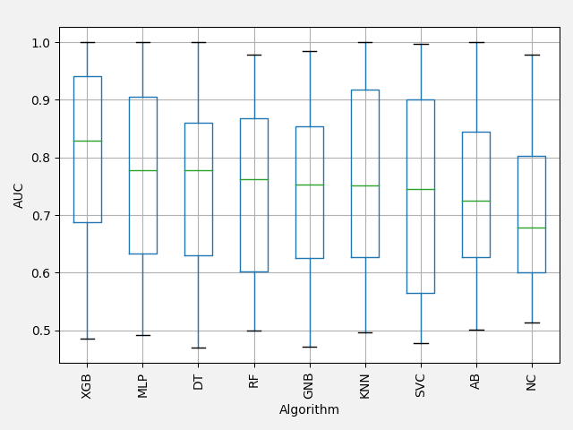
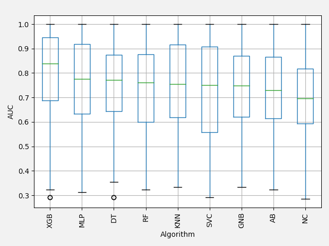
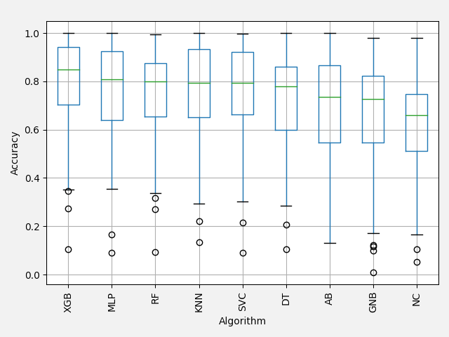
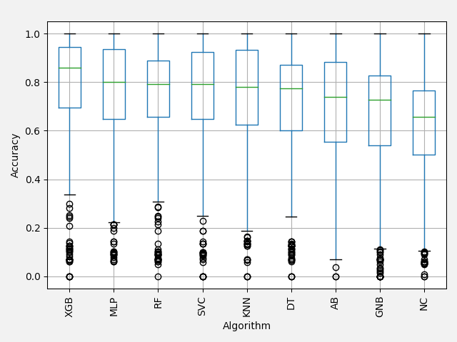
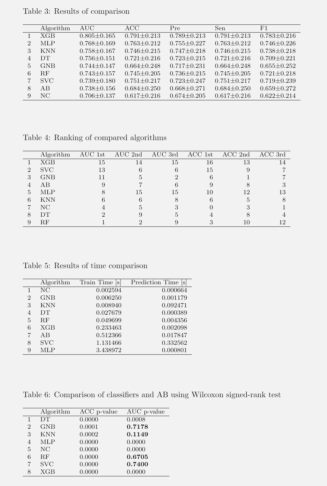
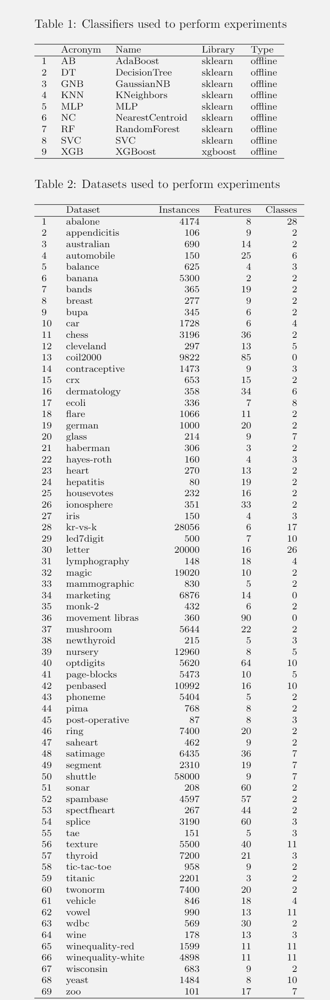

.. highlight:: shell

===============
Example Results
===============

Comparison Plots
-----------------

Boxplot for AUC values per dataset:

Boxplot for AUC values per dataset fold:

Boxplot for ACC values per dataset:

Boxplot for ACC values per dataset fold:

Comparison Tables
-----------------

Info Tables
-----------

